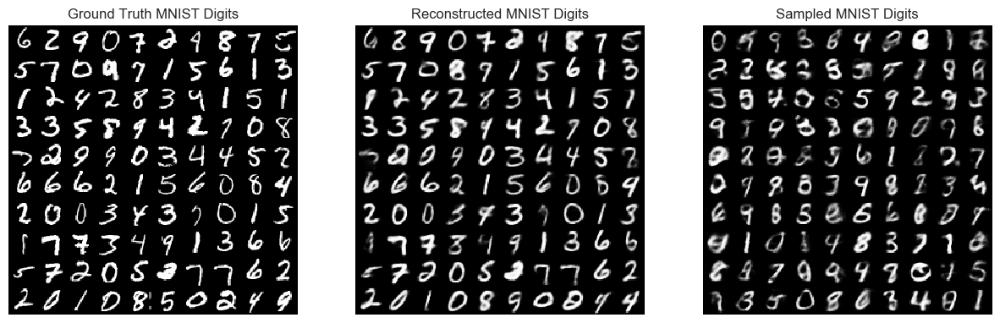

# Importance Weighted Autoencoders (IWAE)
I had difficulty finding a simple IWAE implementation in pytorch, so i decided to create and share my own. There is both a model with explicit notation and one using pytorch's in-built functions. 

Link to paper: https://arxiv.org/abs/1509.00519

## Importance Weighted Autoencoders - Gaussian encoder, Bernoulli decoder 
#### Analytical IWAE Loss Curve:

#### Analytical IWAE 60 epoch results:

#### Training gif

