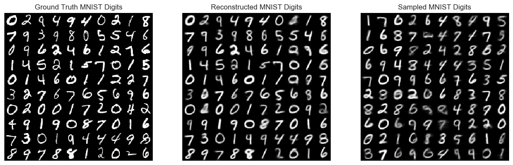
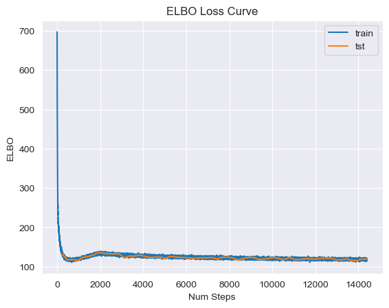

# Importance Weighted Autoencoders (IWAE)
Link to paper: https://arxiv.org/abs/1509.00519

<b>AnalyticalIWAE:</b> IWAE calculating loss manually

<b>PytorchIWAE:</b> IWAE using built-in torch functions to evaluate and calculation loss.  
Includes example of algorithm very easy to apply to existing VAE (although a bit slower)

<b>ConvIWAE:</b> An example of convolutional IWAE, not integrated with main script, only as example

# Importance Weighted Autoencoders - Gaussian encoder and decoder
#### Pytorch IWAE Loss Curve:

#### Pytorch IWAE 60 epoch results:

#### Training gif

## Importance Weighted Autoencoders - Gaussian encoder, Bernoulli decoder 
#### Analytical IWAE Loss Curve:

#### Analytical IWAE 60 epoch results:

#### Training gif

